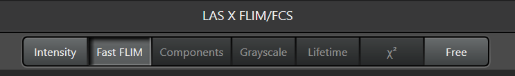
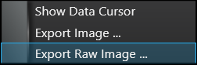
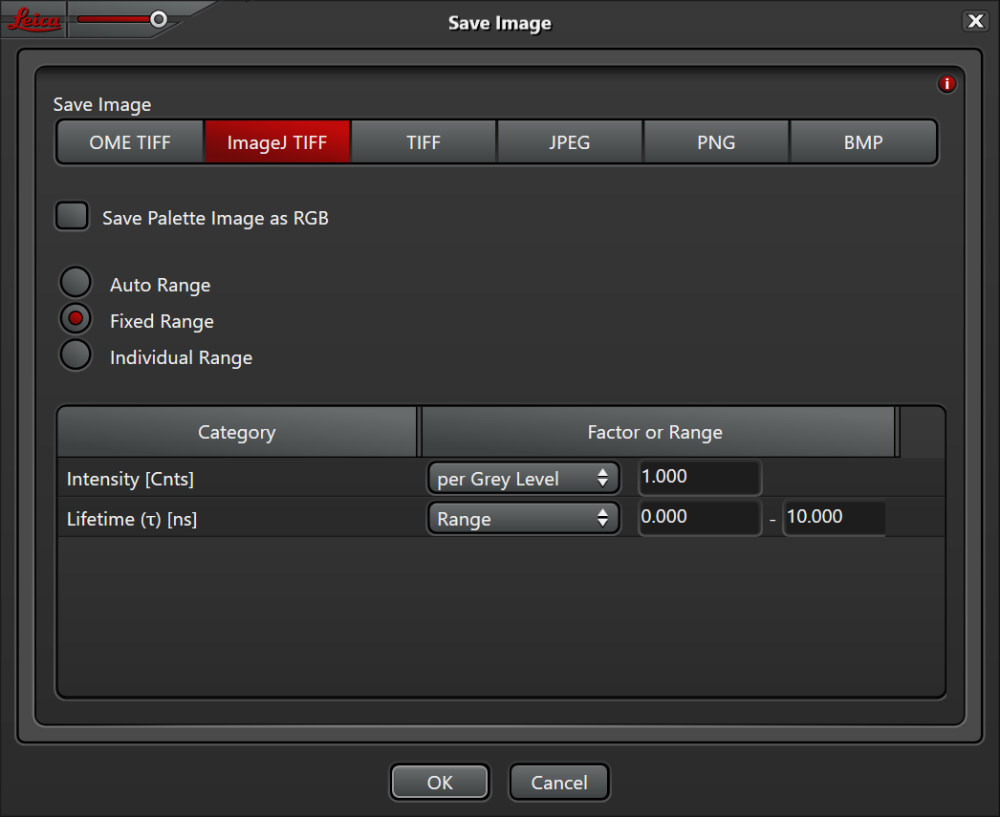
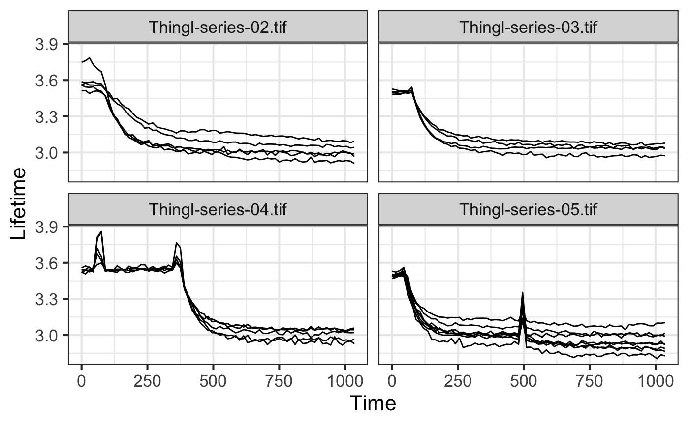

# Simple, fit-free analysis of timelapse FLIM data

In this repository you will find a step-by-step explanation of how lifetime data acquired with the Leica Stellaris8 can be exported and analysed with ImageJ and R/ggplot2.
The analysis is simple and fit-free as it uses the arrival times that are determined by the 'Fast FLIM' mode in the Leica Software. For a more comprehensive analysis use the full decay.

The analysis consists of three steps; 1) export the data, 2) quantify ROIs, 3) plot the data.

Here we use FLIM data that was acquired from a Turquoise-based FLIM biosensor that detects Glucose as an example (Botman et al., 2024, doi:[10.1101/2024.11.29.626064](https://doi.org/10.1101/2024.11.29.626064)). Timelapse data were acquired, for 70 frames.

### Step 1. Export

- In the Leica software, make sure that the lifetime data is visible (the 'Fast FLIM' tab should be selected):

- Now right-click in the lifetime image with the mouse button and select 'Export Raw Data':

- A window pops up and make sure that the settings are exactly like the screenshot included here:

This will save a TIF stack that has 2 'Channels' for each timepoint. The first Channel has the intensity information and the second Channel the lifetime data.

### Step 2. Quantification

- Open the TIF stack in ImageJ/FIJI.
- Draw an ROI to select a single cell.

        
- Add the ROI to the ROI manager by pressing `t` on the keyboard or 'Add [t]' on the ROI Manager.
- Repeat until all cells are selected.
- Select all ROIs in the ROI manager.
- Select 'Multi Measure' on the ROI manager (More >> Multi Measure)
- Make sure that only the first box is checked.

- The results are shown in a window like this:

- Save this window with Results as a CSV file.
- Repeat for all TIF stacks.

### Step 3. Visualization

- The analysis will be performed on all CSV files, assuming that each CSV is an independent replicate.
- The code in the .Rmd file assumes that the CSV files are in a subfolder called `output_ImageJ`.
- Run the THINGL-analysis.Rmd script step-by-step and tweak where necessary.
- The resulting plots can be saved individually, but you can also 'knit' the Rmd file to produce an HTML of the notebook that has all the code and output. An example `THINGL-analysis.html` is also included in this repo (download and open in a web browser).
- Example output:

